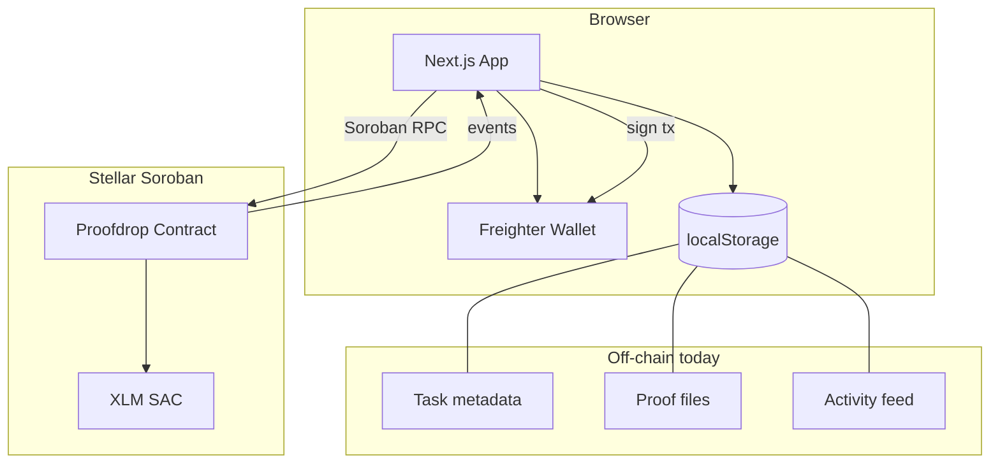

# Proofdrop

[](https://github.com/MisbahAnsar/stellar-proofdrop/actions/workflows/ci.yml)

**Live app:** [https://proofdrop-stellar.vercel.app](https://proofdrop-stellar.vercel.app)

**Testnet contract:** `CAPVLSAV2KGCGYXGJOGRR5XXBL6BDOV5WOOM64NLNDHUNKHWUIBQEBLC` — see [`docs/deployment.testnet.json`](docs/deployment.testnet.json) and [`docs/SUBMISSION.md`](docs/SUBMISSION.md).

Paid tasks with on-chain proof verification on **Stellar Soroban**.

Creators fund tasks with XLM locked in a smart contract. Workers submit proof off-chain; only a **SHA-256 hash** is stored on-chain. Creators review submissions and release payment on approval.

## Screenshots

> Add images to [`docs/screenshots/`](docs/screenshots/) and uncomment the lines below.

<!--


-->

_Placeholder — screenshots coming soon._

## Features

- Freighter wallet connect / disconnect
- Create funded tasks on Soroban testnet
- Proof upload with client-side hashing and local preview
- Creator approve / reject with automatic payment release
- Live dashboard with event-driven updates (no manual refresh)
- Accessible UI: skeletons, empty states, error boundaries

## Stack

| Layer     | Technology                                               |
| --------- | -------------------------------------------------------- |
| Frontend  | Next.js 16, React 19, TypeScript, Tailwind v4, shadcn/ui |
| State     | TanStack React Query, React Hook Form, Zod               |
| Wallet    | Freighter (`@stellar/freighter-api`)                     |
| Chain     | `@stellar/stellar-sdk`, Soroban RPC                      |
| Contracts | Rust, Soroban SDK 25                                     |
| Tooling   | Bun, Vitest, ESLint, Prettier, GitHub Actions            |

## Installation

### Prerequisites

- [Bun](https://bun.sh) 1.1+ (or Node.js 20+)
- [Freighter](https://www.freighter.app/) browser extension
- [Rust](https://rustup.rs/) 1.84+ (for contracts only)
- Stellar CLI / Soroban CLI (for contract deployment)

```bash
rustup target add wasm32v1-none
```

### Setup

```bash
git clone https://github.com/MisbahAnsar/stellar-proofdrop.git
cd stellar-proofdrop
bun install
cp .env.example .env.local
```

Edit `.env.local` and set `NEXT_PUBLIC_PROOFDROP_CONTRACT_ID` after deploying the contract (see [Deployment](#deployment)).

### Development

```bash
bun dev
```

Open [http://localhost:3000](http://localhost:3000).

### Production build

```bash
bun run build
bun start
```

## Environment variables

Copy [`.env.example`](.env.example) to `.env.local`:

| Variable                            | Required | Description                 | Default                                 |
| ----------------------------------- | -------- | --------------------------- | --------------------------------------- |
| `NEXT_PUBLIC_APP_URL`               | No       | Public app URL              | `https://proofdrop-stellar.vercel.app`  |
| `NEXT_PUBLIC_STELLAR_NETWORK`       | No       | `testnet` or `mainnet`      | `testnet`                               |
| `NEXT_PUBLIC_SOROBAN_RPC_URL`       | No       | Custom Soroban RPC URL      | Network default (leave unset on Vercel) |
| `NEXT_PUBLIC_PROOFDROP_CONTRACT_ID` | Yes\*    | Deployed contract ID (`C…`) | —                                       |

\*Required for on-chain flows. **Deployed testnet ID:** `CAPVLSAV2KGCGYXGJOGRR5XXBL6BDOV5WOOM64NLNDHUNKHWUIBQEBLC`

## Architecture



**Design principles**

1. **Funds on-chain** — rewards are locked in the Proofdrop contract until approval.
2. **Proof off-chain** — file content stays local; only the hash is stored on-chain.
3. **Event-driven UI** — Soroban RPC polling syncs metadata across wallets; `taskEventBus` + React Query keep lists fresh without reloads.
4. **Thin client** — transaction helpers in `src/services/stellar/` follow prepare → sign → submit → confirm.
5. **Inter-contract calls** — the escrow contract uses Soroban `token::Client` to transfer XLM via the testnet Stellar Asset Contract (SAC).

### Task lifecycle

```
Open → ProofSubmitted → Approved (payment released)
                    ↘ Rejected → Open (resubmit)
```

## Folder structure

```
stellar-proofdrop/
├── .github/workflows/     # CI (lint, format, test, build)
├── contracts/
│   └── proveit/           # Soroban escrow contract (Rust)
├── docs/
│   └── screenshots/       # README screenshot assets
├── src/
│   ├── app/               # Next.js App Router pages
│   ├── components/
│   │   ├── feedback/      # Error fallback, loading regions
│   │   ├── layout/        # Shell, navbar, page header
│   │   ├── skeletons/     # Loading skeletons
│   │   ├── ui/            # shadcn/ui primitives
│   │   └── wallet/        # Freighter controls
│   ├── config/            # Site + Stellar network config
│   ├── features/
│   │   ├── dashboard/     # Dashboard sections + activity
│   │   └── tasks/         # Forms, hooks, task UI
│   ├── lib/
│   │   ├── dashboard/     # Filters, activity helpers
│   │   ├── events/        # In-app event bus
│   │   ├── proof/         # Hashing + validation
│   │   └── stellar/       # Amounts, errors
│   ├── providers/         # React Query, wallet, event sync
│   ├── services/
│   │   ├── activity/      # Activity localStorage store
│   │   ├── proofs/        # Proof file store
│   │   ├── stellar/       # Soroban transactions + events
│   │   ├── tasks/         # Task metadata store
│   │   └── wallet/        # Freighter integration
│   └── types/             # Shared TypeScript types
├── .env.example
├── vitest.config.ts
└── package.json
```

Contract details: [`contracts/README.md`](contracts/README.md)

## Soroban contract

The `proveit` contract escrows XLM and coordinates the task lifecycle.

| Function         | Who calls | Effect                                   |
| ---------------- | --------- | ---------------------------------------- |
| `initialize`     | Admin     | Set reward token (XLM SAC)               |
| `create_task`    | Creator   | Lock XLM, emit `task_created`            |
| `submit_proof`   | Worker    | Store proof hash, emit `proof_submitted` |
| `approve_task`   | Creator   | Pay worker, emit `task_approved`         |
| `reject_task`    | Creator   | Reopen task, emit `task_rejected`        |
| `get_task`       | Anyone    | Read task state                          |
| `get_task_count` | Anyone    | Total tasks                              |

**On-chain task fields:** `creator`, `reward`, `proof_hash`, `worker`, `status`

**Events:** `task_created`, `proof_submitted`, `task_approved`, `task_rejected`

Build and test:

```bash
bun run test:contracts
cd contracts && cargo build --target wasm32v1-none --release
```

Redeploy the contract after pulling contract changes before testing on testnet.

## Demo instructions

End-to-end walkthrough on **Stellar testnet**:

### 1. Prepare wallets

- Install [Freighter](https://www.freighter.app/)
- Switch Freighter to **Testnet**
- Fund two accounts from a [friendbot faucet](https://laboratory.stellar.org/#account-creator?network=testnet) (creator + worker)

### 2. Deploy contract

Deploy `contracts/proveit` with your preferred Soroban workflow, then copy the contract ID into `.env.local`:

```env
NEXT_PUBLIC_PROOFDROP_CONTRACT_ID=C...
NEXT_PUBLIC_STELLAR_NETWORK=testnet
NEXT_PUBLIC_APP_URL=https://proofdrop-stellar.vercel.app
```

Restart `bun dev`.

### 3. Create a task (creator wallet)

1. Open `/create` and connect Freighter as the **creator**
2. Fill title, description, reward (e.g. `1` XLM), optional deadline
3. Submit and approve the transaction in Freighter
4. Confirm the task appears on `/dashboard` (home lists **open** tasks only)

### 4. Submit proof (worker wallet)

1. Open the task from the home list (`/tasks/[id]`)
2. Connect Freighter as the **worker**
3. Upload a proof file (JPEG, PNG, WebP, PDF, or text ≤ 5 MB)
4. Submit proof — only the hash is written on-chain

### 5. Review (creator wallet)

1. Open `/dashboard` as the **creator**
2. Find the task under **Pending reviews**
3. **Approve** to release XLM to the worker, or **Reject** to reopen the task

Activity and lists update automatically via Soroban event polling and the in-app event bus.

**Multi-wallet demo:** Task metadata and proofs still live in each browser's `localStorage`, but opening the app polls Soroban contract events and merges task status into local storage — so a worker on another machine sees new tasks and proof/review updates without manual refresh.

## Deployment

### Frontend (Vercel)

Production URL: **https://proofdrop-stellar.vercel.app**

1. Import the repo in [Vercel](https://vercel.com)
2. Framework preset: **Next.js** (or use included `vercel.json`)
3. Add these **Environment Variables** (Production + Preview):

```env
NEXT_PUBLIC_APP_URL=https://proofdrop-stellar.vercel.app
NEXT_PUBLIC_STELLAR_NETWORK=testnet
NEXT_PUBLIC_PROOFDROP_CONTRACT_ID=CAPVLSAV2KGCGYXGJOGRR5XXBL6BDOV5WOOM64NLNDHUNKHWUIBQEBLC
```

4. Leave `NEXT_PUBLIC_SOROBAN_RPC_URL` **unset** unless you use a custom RPC
5. Deploy — build command `bun run build`, install `bun install`

Works on any Node-compatible host — all `NEXT_PUBLIC_*` vars must be set at **build time**.

### Contract (testnet)

Deployed contract and transaction hashes are recorded in [`docs/deployment.testnet.json`](docs/deployment.testnet.json).

```bash
cd contracts
cargo build --target wasm32v1-none --release
bun run deploy:contract   # from repo root — uploads WASM, deploys, initializes
```

After deployment:

1. `initialize` is called automatically with the testnet XLM SAC
2. Set `NEXT_PUBLIC_PROOFDROP_CONTRACT_ID` in Vercel / `.env.local`
3. Redeploy the frontend

## How to test

### Quick local test

```bash
bun install
cp .env.example .env.local
# Add your contract ID to .env.local
bun dev
```

Open [http://localhost:3000](http://localhost:3000), connect Freighter on **Testnet**, and walk through create → submit proof → review.

### Test against production

1. Open [https://proofdrop-stellar.vercel.app](https://proofdrop-stellar.vercel.app)
2. Install [Freighter](https://www.freighter.app/) and switch to **Testnet**
3. Fund accounts via [Stellar Laboratory friendbot](https://laboratory.stellar.org/#account-creator?network=testnet)
4. **Creator:** `/create` → fund a task → approve tx in Freighter
5. **Worker:** open the task → upload proof → submit
6. **Creator:** `/dashboard` → Pending reviews → Approve or Reject

Transaction hashes appear in toasts and task metadata after confirmation.

### Automated tests

```bash
bun run test:frontend   # 25 Vitest tests
bun run test:contracts  # 28 Soroban contract tests
bun run ci              # full pipeline including production build
```

## Testing (CI)

| Suite           | Command                  | Count                                     |
| --------------- | ------------------------ | ----------------------------------------- |
| Frontend        | `bun run test:frontend`  | 25 tests                                  |
| Contracts       | `bun run test:contracts` | 28 tests                                  |
| Full CI locally | `bun run ci`             | lint + format + typecheck + tests + build |

GitHub Actions runs on every push/PR to `main` (lint, format check, typecheck, tests, build): [`.github/workflows/ci.yml`](.github/workflows/ci.yml)

## Developer notes

### Scripts

| Command                           | Description            |
| --------------------------------- | ---------------------- |
| `bun dev`                         | Development server     |
| `bun run build`                   | Production build       |
| `bun run lint` / `lint:fix`       | ESLint                 |
| `bun run format` / `format:check` | Prettier write / check |
| `bun run typecheck`               | `tsc --noEmit`         |
| `bun run test:watch`              | Vitest watch mode      |

### Conventions

- **Light theme only** — white background, gray borders, no gradients
- **Feature folders** — colocate UI, hooks, and schemas under `src/features/`
- **Services** — side effects (RPC, storage) live in `src/services/`
- **Event bus** — `taskEventBus` for cross-page refresh without prop drilling
- **Transactions** — use `signAndSubmitTransaction` in `src/services/stellar/transaction.ts`

### Adding shadcn components

```bash
bunx shadcn@latest add <component>
```

### Local storage limitation

Task metadata and proof files are stored in `localStorage` for demo purposes. They are **per-browser** — proof file previews are not shared across devices. Soroban event polling merges on-chain status (open, proof submitted, approved) into local metadata so multi-wallet demos work when each participant has the app open.

## Future improvements

- [ ] Backend API for task metadata and proof storage (IPFS/S3)
- [ ] On-chain `get_task` reads in the UI for cross-device consistency
- [ ] Task cancellation and creator refunds
- [ ] Deadline enforcement
- [ ] Mainnet deployment guide and audited contract release
- [ ] Multi-asset rewards beyond XLM SAC
- [ ] Notification webhooks for proof submissions

## Contributing

1. Fork the repository
2. Create a feature branch
3. Run `bun run ci` before opening a PR
4. Open a pull request with a clear description

## Submission

See [`docs/SUBMISSION.md`](docs/SUBMISSION.md) for the full checklist, deployed contract address, transaction hashes, and items you need to capture manually (screenshots, demo video).

## License

[MIT](LICENSE)
